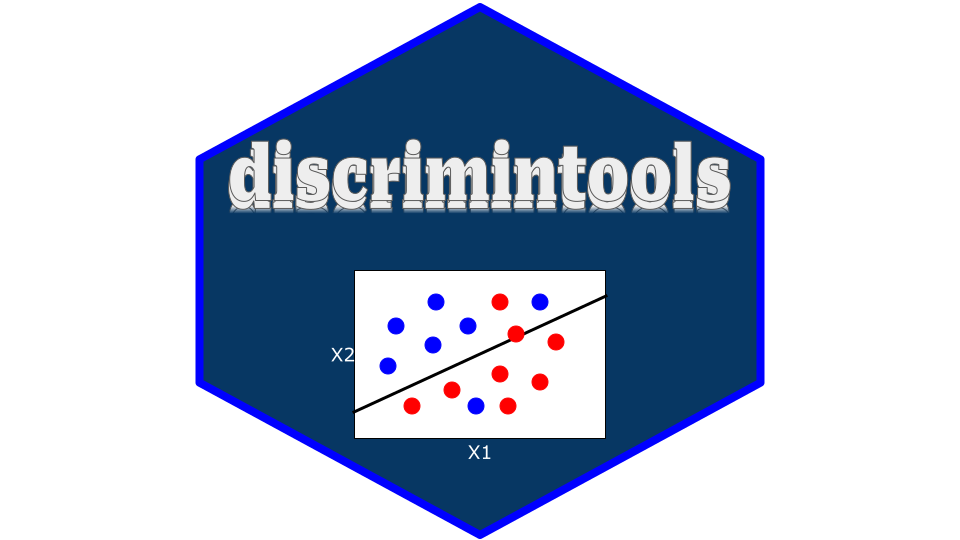

<p align="center">
    </img>
</p>

<div align="center">

[](https://github.com/enfantbenidedieu/discrimintools/blob/master/LICENSE)
[](https://pypi.org/project/discrimintools/)
[](https://pepy.tech/project/discrimintools)
[](https://pepy.tech/project/discrimintools)
[](https://pepy.tech/project/discrimintools)

</div>


# discrimintools : Python library for Discriminant Analysis (DA)

discrimintools is a python package dedicated to Discriminant Analysis (DA) distributed under the MIT License.

## Overview

Discriminant analysis is a classification problem, where two or more groups or clusters or populations are known _a priori_ and one or more new observations are classified into one of the known populations based on the measured characteristics.

## Why use discrimintools?

With this discrimintools package, you can perform :

* Canonical Discriminant Analysis (CANDISC)
* Linear Discriminant Analysis (LDA)
* Principal Components Analysis - Discriminant Analysis (PCADA)
* Discriminant Analysis on Qualitatives variables (DISQUAL)
* Discriminant Analysis on Mixed Data (DISMIX)
* Discriminant Correspondence Analysis (DISCA)
* Stepwise Discriminant Analysis (STEPDISC)

## Installation

### Dependencies

discrimintools requires 

```bash
Python >= 3.10
numpy >=1.26.4
pandas >=2.2.2
scikit-learn >=1.2.2
polars >=0.19.2
plotnine >=0.10.1
mapply >=0.1.21
scientisttools >=0.1.5
statsmodels >=0.14.0
scipy >=1.10.1
```

### User installation

You can install discrimintools using pip :

```bash
pip install discrimintools
```

## Example

```python
from discrimintools.datasets import load_wine
wine = load_wine()
wine.info()
```

```
<class 'pandas.core.frame.DataFrame'>
RangeIndex: 178 entries, 0 to 177
Data columns (total 14 columns):
 #   Column          Non-Null Count  Dtype   
---  ------          --------------  -----   
 0   Cultivar        178 non-null    category
 1   Alcohol         178 non-null    float64 
 2   MalicAcid       178 non-null    float64 
 3   Ash             178 non-null    float64 
 4   AlcAsh          178 non-null    float64 
 5   Mg              178 non-null    int32   
 6   Phenols         178 non-null    float64 
 7   Flav            178 non-null    float64 
 8   NonFlavPhenols  178 non-null    float64 
 9   Proa            178 non-null    float64 
 10  Color           178 non-null    float64 
 11  Hue             178 non-null    float64 
 12  OD              178 non-null    float64 
 13  Proline         178 non-null    int32   
dtypes: category(1), float64(11), int32(2)
memory usage: 17.1 KB
```


```python
# Linear Discriminant Analysis (LDA)
from discrimintools import LDA
res_lda = LDA(target=["Cultivar"],features=None,priors="prop")
res_lda.fit(wine)
```

## Documentation

The docstring is written in english

## References

> [http://www.math.wpi.edu/saspdf/stat/chap25.pdf](http://www.math.wpi.edu/saspdf/stat/chap25.pdf)

> [https://support.sas.com/documentation/cdl/en/statugdiscrim/61779/PDF/default/statugdiscrim.pdf](https://support.sas.com/documentation/cdl/en/statugdiscrim/61779/PDF/default/statugdiscrim.pdf)

> [https://online.stat.psu.edu/stat505/lesson/10](https://online.stat.psu.edu/stat505/lesson/10)

> [https://eric.univ-lyon2.fr/ricco/cours/slides/analyse_discriminante.pdf](https://eric.univ-lyon2.fr/ricco/cours/slides/analyse_discriminante.pdf)

> [https://eric.univ-lyon2.fr/ricco/cours/cours/Pratique_Analyse_Discriminante_Lineaire.pdf](https://eric.univ-lyon2.fr/ricco/cours/cours/Pratique_Analyse_Discriminante_Lineaire.pdf)

## Authors

Duvérier DJIFACK ZEBAZE [duverierdjifack@gmail.com](mailto:duverierdjifack@gmail.com)